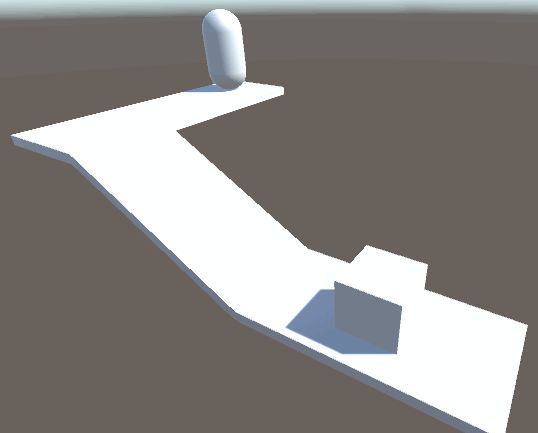
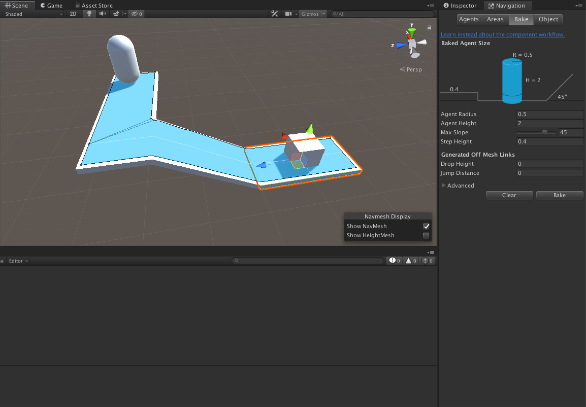
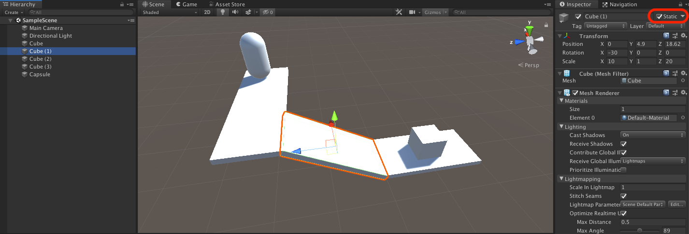
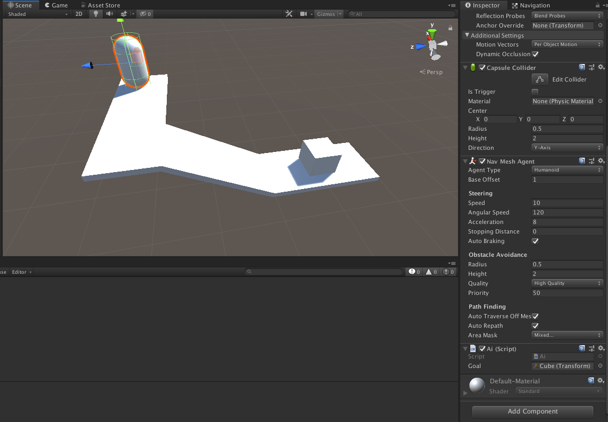
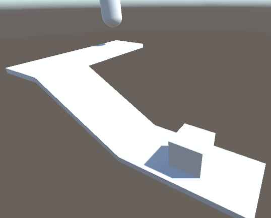

# NavMesh

## なぜこのサンプルを作ったか

だいぶ前からある機能だが気になったので試してみたくなった

## What is this?

キャラクターをゴールに向けて移動させる機能

障害物を避けて移動したり、ゴールへの最適な移動ルートを判断させる仕組み。

## How to use?

1. マップを作る
2. NavMesh を Bake する（移動ルートを定義する）
3. キャラクターを設定し、NavMeshAgent を付与する（移動の設定を行う）

|Bakeされてる様子|マップに static が必須な様子|NavMeshAgentを付与した動くオブジェクトのInspector|
|---|---|---|
||||

## リファレンス

実はいっぱい先見の人がいて、それを Unity 2019.3.0a2 形式でアレンジしただけだったりする。

* [NavMeshの使い方　その１ - テラシュールブログ](http://tsubakit1.hateblo.jp/entry/20120127/1327591104)
* [NavMeshの使い方　その１ - テラシュールブログ](http://tsubakit1.hateblo.jp/entry/20120128/1327679742)
* [NavMesh Agent の作成 - Unity Documentation](https://docs.unity3d.com/ja/2018.1/Manual/nav-CreateNavMeshAgent.html)
* [NavMeshAgent - Unity Docmentation](https://docs.unity3d.com/ja/current/ScriptReference/AI.NavMeshAgent.html)

## 所感

先人のテラシュールブログこと @tsubaki_t1 さんは Unity 3.5 の登場時だったので、場所が変わっていて

* Unity 3.5 ... [Window] -> [Navigation]
* Unity 2019.3.0a2 ... [Window] -> [AI] -> [Navigation]

となっていたところだろうか。

本格的に AI 機能として搭載されていて、 AssetStore を利用すればこの辺が拡張されそうなのはいいなぁと感じた。

それと、 テラシュールブログでも触れられているが、この機能は Rigidbody とは別の力で動いているので、 Rigidbody をつけたところで重力を無視して接地しやがった（クソゥ...

